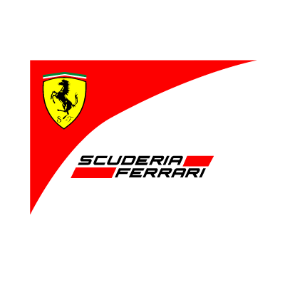

# Scuderia Ferrari - WRO Future Engineers 🏎️🤖


## 📌 Обзор проекта
**Scuderia Ferrari** — это проект автономного мобильного робота, разработанного специально для категории **WRO Future Engineers**. Робот спроектирован для прохождения соревновательной трассы, объезда препятствий и выполнения автономных заездов с использованием современных инженерных решений.

Проект прошел путь от сложных систем на базе Raspberry Pi до оптимизированного и надежного решения на **Arduino**, что позволило добиться детерминированного управления в реальном времени.

---

## 🛠 Технические характеристики
| Компонент | Описание |
| :--- | :--- |
| **Микроконтроллер** | Arduino Mega 2560 / Uno |
| **Привод** | Задний (RWD) с 3D-печатным дифференциалом |
| **Двигатель** | N20 Micro DC (6V, 105 RPM) с магнитным энкодером |
| **Рулевое управление** | Сервопривод (Аккермановская геометрия) |
| **Питание** | 2 × Li-ion 18650 (7.4V) |
| **Датчики** | MPU-6050 (Гироскоп), TCS-типа (Цвет), HC-SR04 (Ультразвук) |

---

## 🏗 Инженерные решения (v3)
Текущая версия робота (v3) использует **двухуровневую конструкцию шасси**, напечатанную на 3D-принтере:
1.  **Нижний уровень:** Силовая установка, драйвер моторов L298N и основная разводка.
2.  **Верхний уровень:** Аккумуляторный отсек, датчики и контроллер. Такое распределение веса снижает центр тяжести и повышает устойчивость при поворотах.

### Ключевые особенности:
*   **3D Дифференциал:** Обеспечивает плавные повороты и равномерное распределение крутящего момента без необходимости сложной программной синхронизации двух моторов.
*   **Отказ от Raspberry Pi:** Переход на Arduino позволил устранить проблемы с просадкой напряжения и обеспечил мгновенный запуск системы.
*   **Система восприятия:** Вместо камеры используется комбинация RGB-датчика цвета (для распознавания столбов) и ультразвукового датчика (для контроля дистанции).

---

## 💻 Программная архитектура
Логика управления построена на базе **конечного автомата (FSM)**, что делает поведение робота предсказуемым и легким в отладке.

### Основные состояния:
*   `INIT`: Калибровка гироскопа и центровка руля.
*   `DRIVE_STRAIGHT`: Удержание курса с помощью П-регулятора по данным MPU-6050.
*   `TURN`: Выполнение поворота на 90° при достижении порогового значения угла.
*   `AVOID_OBSTACLE`: Объезд препятствий (Красный — справа, Зеленый — слева).

---

## 📂 Структура репозитория
```text
.
├── assets/             # Изображения и логотипы для документации
├── Scuderia_Ferrari/   # Исходные файлы проекта (STL, STEP, Docs)
│   ├── 2nd floor.stl   # 3D модель верхнего уровня
│   ├── Main rack.stl   # Основная рама
│   ├── WRO FE v9.step  # Полная сборка в формате STEP
│   └── ...             # Другие детали и документация
└── README.md           # Этот файл
```

---

## 🚀 Как запустить
1.  Соберите шасси, используя STL-файлы из папки `Scuderia_Ferrari`.
2.  Подключите электронику согласно схеме (Arduino + L298N + N20).
3.  Загрузите прошивку в Arduino IDE (код находится в процессе подготовки к публикации).
4.  Откалибруйте датчик цвета под освещение вашей трассы.

---

## 📸 Галерея
<p align="center">
  
</p>

---
*Разработано для соревнований World Robot Olympiad (WRO) Future Engineers.*
