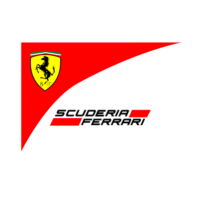
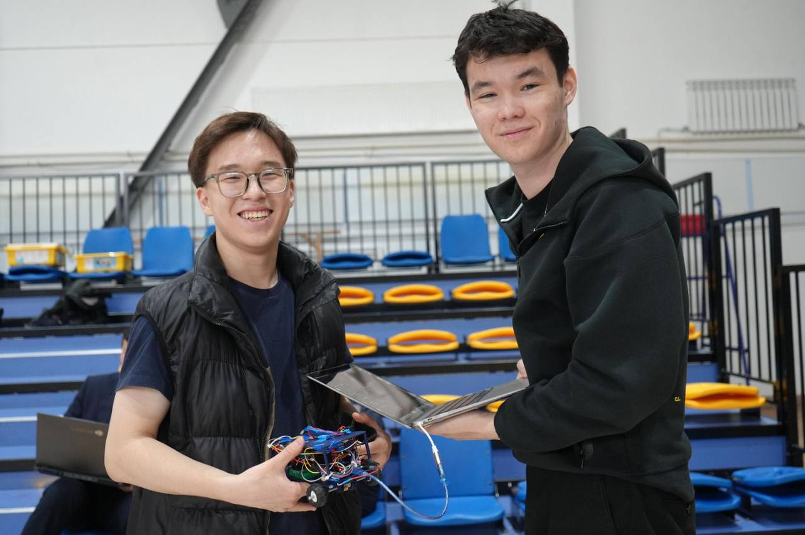

# Scuderia Ferrari — WRO Future Engineers 2025 🏎️🤖

<p align="center">
  
</p>

## 🌟 Обзор проекта
**Scuderia Ferrari** — это команда, представляющая высокотехнологичного автономного робота для категории **WRO Future Engineers**. Наш робот спроектирован для полностью автономного прохождения трассы, эффективного объезда препятствий и стабильного маневрирования с использованием передовых алгоритмов управления и технического зрения.

Проект прошел через три ключевые итерации дизайна, эволюционировав от прототипа на Arduino до финальной, надежной системы на базе **LEGO Mindstorms EV3** и **Python (pybricks)**. Название нашей команды вдохновлено легендарной гоночной конюшней Formula 1, чья страсть к инновациям и скорости стала для нас главным ориентиром.

---

## 👥 Наша Команда
Мы — группа молодых инженеров, объединенных страстью к робототехнике и автономным системам. Каждый из нас внес уникальный вклад в разработку механики, электроники и программного обеспечения этого робота.

<p align="center">
  
  <br>
  <i>Команда Scuderia Ferrari в процессе разработки и тестирования</i>
</p>

---

## 🏆 О категории WRO Future Engineers 2025
Категория **Future Engineers** в рамках World Robot Olympiad — это сложнейшее испытание для молодых разработчиков (от 14 до 22 лет). Основная задача заключается в создании полностью автономного транспортного средства, способного ориентироваться в динамически меняющейся среде.

### Основные требования сезона 2025:
*   **Автономность:** Робот должен самостоятельно определять направление движения, объезжать препятствия (зеленые и красные кубики) и завершать заезд после 11 кругов.
*   **Техническое зрение:** Использование камер для распознавания цветов и объектов является обязательным условием для успешного прохождения трассы.
*   **Габариты:** Робот должен вписываться в строгие рамки (максимум 300x200x250 мм), что требует плотной компоновки всех узлов.
*   **Открытость:** Все чертежи, схемы и код должны быть задокументированы и доступны в репозитории (Open Source).

---

## 🛠 Технические характеристики

| Компонент | Описание |
| :--- | :--- |
| **Контроллер** | LEGO Mindstorms EV3 Hub (Оптимизирован для работы с MicroPython) |
| **Язык ПО** | Python (библиотека pybricks) |
| **Привод** | Задний (RWD) с LEGO-дифференциалом и модом Half-Bush #32124 |
| **Рулевое** | Переднее, реализовано по схеме Аккермана для идеального радиуса поворота |
| **Зрение** | Pixy Cam 2.1 (распознавание объектов и сторон объезда в реальном времени) |
| **Навигация** | Датчик цвета (метки трассы), Ультразвуковой датчик (дистанция до стен) |
| **Питание** | Стандартный аккумулятор LEGO EV3 (с программным контролем заряда) |

---

## 🏗 Инженерные решения и эволюция (V1 -> V3)

### Итерации конструкции
1.  **V1 (Arduino):** Первый прототип на базе микроконтроллера Arduino. Хотя система была гибкой, она оказалась недостаточно надежной для соревновательных условий из-за хрупкости соединений и сложности быстрой отладки "в поле".
2.  **V2 (EV3 Initial):** Переход на платформу LEGO EV3 позволил использовать мощную библиотеку `pybricks`. Однако первые тесты выявили проблемы с жесткостью рамы и люфтом передней оси, что приводило к нестабильному удержанию курса.
3.  **V3 (Final):** Текущая версия. Мы внедрили усиление крепления оси балками и использование **LEGO Half-Bush #32124** внутри дифференциала. Это решение полностью устранило люфт и обеспечило плавность хода, необходимую для точного управления на высоких скоростях.

### Ключевые особенности механики:
*   **Дифференциал с модом:** Механическое распределение момента в поворотах, дополненное фиксацией люфта. Это позволяет внутреннему колесу вращаться медленнее внешнего без потери сцепления.
*   **Геометрия Аккермана:** Математически выверенное рулевое управление. Мы рассчитали углы поворота так, чтобы центры окружностей, описываемых всеми колесами, пересекались в одной точке. Это минимизирует проскальзывание и износ покрышек.
*   **Оптимизация сцепления:** Смена стандартных шин на более мягкие и программное снижение скорости на поворотах решили проблему пробуксовки на гладком покрытии трассы.

---

## 💻 Алгоритмы и Программная архитектура

Логика робота базируется на **трехэтапном конечном автомате (State Machine)**. Мы отказались от использования таймеров в пользу событийной модели, где переходы привязаны к физическим событиям и одометрии.

### Основные этапы:
1.  **Stage 1 (Start & Scan):** Робот плавно выходит из стартовой зоны. В этот момент Pixy Cam сканирует первый маркер, чтобы определить направление заезда (по часовой или против часовой стрелки).
2.  **Stage 2 (Main Race):** Прохождение 11 кругов. Робот использует П-регулятор (Пропорциональный регулятор) для удержания дистанции 28 см от стены. Данные сонара фильтруются для исключения ложных срабатываний от стоек препятствий.
3.  **Stage 3 (Finish):** После детекции 12-й финишной линии робот переходит в режим торможения, игнорируя датчики препятствий, и останавливается ровно в центре финишного створа.

### П-регулятор управления:
Для плавного движения вдоль стен мы используем формулу:
`error = target_distance - current_distance`
`steering_angle = error * Kp`
Где `Kp` — коэффициент пропорциональности, подобранный экспериментально для компенсации инерции системы.

### Одометрический фильтр:
Для защиты от "дребезга" датчика цвета реализован фильтр: новый маркер засчитывается только если энкодер маршевого мотора повернулся более чем на **1000°**. Это делает систему устойчивой к любым скоростям движения и исключает двойной учет одной и той же линии.

---

## 🏎️ Вдохновение: Наследие Ferrari
Выбор названия **Scuderia Ferrari** не случаен. Мы вдохновлялись историей Энцо Феррари, который говорил: *"Я не просто строю машины, я строю эмоции"*. В нашем роботе мы постарались воплотить те же принципы:
*   **Внимание к деталям:** Каждая балка и каждый провод уложены максимально эффективно.
*   **Постоянное совершенствование:** Переход от V1 к V3 — это наш путь "Formula 1", где каждая итерация делает машину быстрее и надежнее.
*   **Работа под давлением:** Соревнования WRO требуют умения быстро принимать решения и адаптировать код под новые условия освещения или покрытия.

---

## 📂 Структура репозитория
```text
.
├── 3d-files/           # Модели деталей и общая сборка (STL, STEP)
├── assets/             # Графические материалы (логотипы, баннеры)
├── codes/              # Документация и логика ПО на Python (pybricks)
├── robot-photos/       # Фотографии робота на разных этапах эволюции (V1-V3)
├── schemes/            # Список компонентов (BOM) и электрические схемы
├── team-photos/        # Фотографии участников команды
├── videos/             # Демонстрация работы робота в динамике
└── README.md           # Главный файл документации проекта
```

---

## 🚀 Как воспроизвести проект
1.  **Сборка:** Используйте файлы из папки `3d-files/` для печати кастомных деталей и следуйте спецификации в `schemes/BOM.md` для закупки компонентов.
2.  **Настройка камеры:** Установите Pixy Cam 2.1 в верхней части робота. Используйте утилиту PixyMon для калибровки цветовых сигнатур (красный для левого объезда, зеленый для правого).
3.  **Загрузка ПО:** 
    *   Установите VS Code.
    *   Добавьте расширение "LEGO® MINDSTORMS® EV3 MicroPython".
    *   Подключите хаб и загрузите содержимое папки `codes/`.
4.  **Калибровка:** Отрегулируйте значение `Kp` в коде в зависимости от сцепления поверхности вашей трассы.

---

## 📸 Галерея и Медиа
Подробные фотографии и видео доступны в соответствующих папках:
- [Фотографии эволюции робота](robot-photos/)
- [Видео финальных заездов](videos/)
- [Технический журнал (PDF)](EngineeringJournal.pdf)

---
*Разработано командой Scuderia Ferrari для World Robot Olympiad (WRO) Future Engineers 2025. Мы верим, что будущее за автономным транспортом, и наш проект — маленький шаг в этом направлении.*
